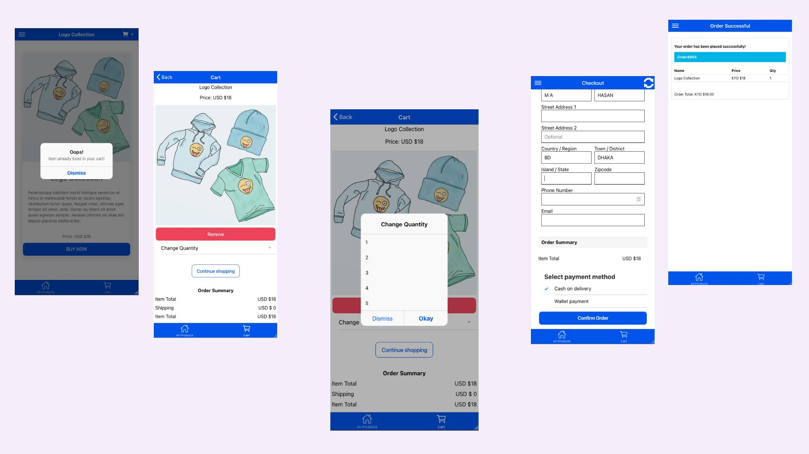
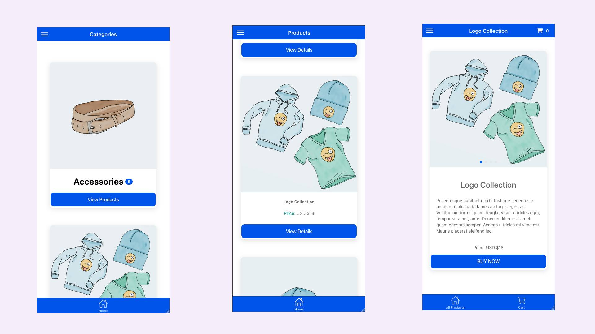
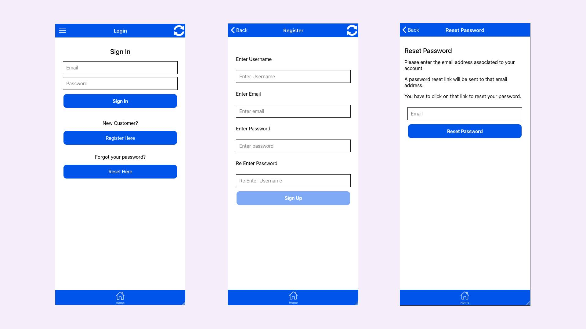

# 🛍️ Complete WooCommerce Mobile App with Ionic + Angular (Hybrid, Android, iOS)

An open-source mobile eCommerce starter built using **Ionic + Angular** that connects with your **WooCommerce + WordPress** store using REST API.

This project provides everything you need to build a modern, mobile-friendly WooCommerce app — login, register, password reset, category list, and product browsing, cart, checkout and place order. 

---

## 🚀 Features

- 🔐 **Login** with WordPress/WooCommerce user credentials
- 📝 **Register** new customers using WooCommerce REST API
- 🔁 **Reset Password** via custom REST API endpoint
- 📦 **Fetch Categories** from WooCommerce store
- 🛒 **Browse Products by Category**
- 🔑 Uses **JWT Authentication**
- 📱 Built with **Ionic Framework** and **Angular**

---

## 📱 Ideal Use Cases

- Mobile eCommerce apps using WooCommerce backend
- Headless WooCommerce solutions
- Hybrid apps with Ionic + Angular
- Quick start for custom shopping apps
- Flutter/React Native alternative with Angular

---

## 🛠️ Tech Stack

- ✅ Ionic Framework (Angular)
- ✅ WooCommerce REST API
- ✅ WordPress REST API
- ✅ JWT Authentication plugin for WordPress
- ✅ Custom API endpoint for password reset

---

## 📦 Installation & Setup

1. **Clone this repo:**

```bash
git clone https://github.com/YOUR_USERNAME/woocommerce-shop-ecommerce-mobile-app-ionic-angular-full.git
cd woocommerce-shop-ecommerce-mobile-app-ionic-angular-full
```
## Screenshot




## 🙌 Author

**M A Hasan**  
🌐 [https://hasan.online](https://hasan.online)


## ⭐ Support This Project

If you find this useful:
- ⭐ Star the repository on GitHub
- 🔗 Share it with fellow Ionic, WordPress, WooCommerce, or mobile app developers
- 💡 Contribute with feedback or pull requests

> Together, we make WordPress more mobile-friendly and developer-first 🚀
